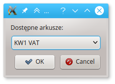

# sheet2jpk_vat
Converts ods/xls sheets to the JPK_VAT xml format


Skrypt generuje plik JPK_VAT (format xml, z pominięciem pośredniego format csv) na podstawie danych z arkusza kalkulacyjnego.
[Przykładowy arkusz](doc/Obroty2018.ods) znajduje się w repozytorium.

Aktualna dokumentacja formatu JPK_VAT: [http://www.finanse.mf.gov.pl/pp/jpk](http://www.finanse.mf.gov.pl/pp/jpk)

## Instalacja:

Skrypt wymaga pakietu [PySide](https://wiki.qt.io/PySide), który lepiej zainstalować jako pakiet systemowy.

### Ubuntu/Kubuntu itp:
```bash
sudo apt-get install python-virtualenv python3-pyside
```
### Gentoo:
```bash
sudo emerge -av dev-python/virtualenv dev-python/pyside
```

### Dalsze kroki (jako użytkownik):
```bash
# utworzenie nowego środowiska dla Python:
virtualenv -p python3 ~/.virtualenvs/jpk_vat
. ~/.virtualenvs/jpk_vat/bin/activate
pip install "git+https://github.com/tomaszhlawiczka/sheet2jpk_vat"
```

W niektórych przypadkach konieczne może być dostarczenie biblioteki PySite, przykładowo (katalogi na różnych dystrybucjach mogą być ułożone w inny sposób):
```bash
ln -s /usr/lib64/python3.6/site-packages/PySide/ ~/.virtualenvs/jpk_vat/lib/python3.6/site-packages/
```

## Uruchomienie:

```bash
# Aktywacja środowiska
. ~/.virtualenvs/jpk_vat/bin/activate
# Uruchomienie
sheet2jpk_vat --path ~/katalog_z_arkuszami --nip 0000000000 --firstname "Imię" --lastname "Nazwisko" --birth '1999-01-30' --email "ksiegowa@example.com" --type VAT7 --departmentcode 2407
```

1. Skrypt w pierwszym kroku poprosi o wybranie pliku z podanego katalogu:


2. Następnie poprosi o wybranie arkusza z podanego pliku



3. W kolejnym kroku trzeba wybrać okres czasu z którego będzie generowany raport.


Dostępne okresy czasu są wybierane ze wskazanego arkusza.
4. Po wybraniu okresu są przedstawiane ewentualne problemy z danymi (np. nieprawidłowa data, nieprawidłowy NIP itp) lub odczytane dane do akceptacji:


5. Zostaje wygenerowany plik XML (JPK_VAT) w tym samym katalogu co źródłowy plik `.ods`
